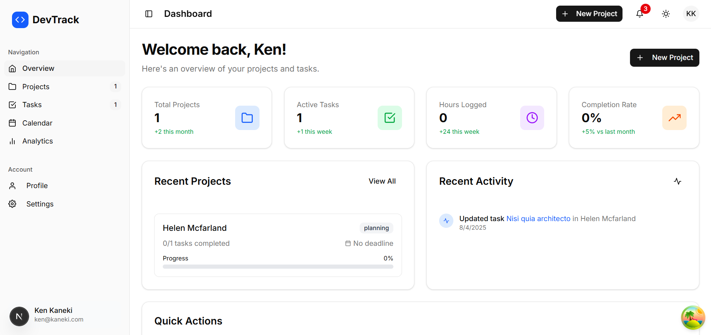

# DevTrack 🚀

A modern, comprehensive project management and development tracking application built with Next.js, designed specifically for developers and development teams.



## ✨ Features

### 🔐 **Authentication & Security**
- **Multi-Provider Authentication**: Google, GitHub, and email/password login
- **Secure Session Management**: JWT-based authentication with NextAuth.js
- **Protected Routes**: Dashboard and API routes secured with authentication middleware
- **User Profile Management**: Comprehensive profile system with real-time updates

### 📊 **Project Management**
- **Full CRUD Operations**: Create, read, update, and delete projects
- **Project Status Tracking**: Planning, Active, On-Hold, Completed statuses
- **Priority Management**: Low, Medium, High, Urgent priority levels
- **Date Management**: Start dates, end dates, and deadline tracking
- **Progress Monitoring**: Visual progress bars and completion tracking

### ✅ **Task Management**
- **Advanced Task System**: Create, assign, and track tasks across projects
- **Status Workflow**: Todo → In Progress → Review → Completed
- **Task Completion**: One-click toggle with optimistic updates
- **Due Date Tracking**: Set and monitor task deadlines
- **Project Association**: Link tasks to specific projects

### 📅 **Smart Calendar**
- **Real-Time Event Generation**: Automatically creates events from project deadlines and task due dates
- **Event Types**: Project deadlines, task deadlines, project starts, overdue items
- **Today's Schedule**: Quick view of today's important items
- **Upcoming Events**: 7-day preview of approaching deadlines
- **Visual Indicators**: Color-coded event types with priority indicators

### 👤 **User Dashboard**
- **Overview Page**: Real-time statistics and recent activity
- **Profile Management**: Editable user profiles with live statistics
- **Recent Activity**: Track completed projects and tasks
- **Performance Metrics**: Success rates, time tracking, completion statistics

### 🎨 **Modern UI/UX**
- **Responsive Design**: Works perfectly on desktop, tablet, and mobile
- **Dark Mode Support**: Beautiful light and dark themes
- **Loading States**: Smooth loading indicators and skeleton screens
- **Optimistic Updates**: Instant UI feedback for better user experience
- **Toast Notifications**: User-friendly success and error messages

### 🔧 **Technical Features**
- **Real-Time Data**: TanStack Query for efficient data fetching and caching
- **Optimistic Updates**: Immediate UI responses with server synchronization
- **Error Handling**: Comprehensive error boundaries and fallbacks
- **Form Validation**: Client-side and server-side validation
- **Search & Filtering**: Advanced filtering options for projects and tasks

## 🛠️ Tech Stack

### **Frontend**
- **Framework**: [Next.js 15](https://nextjs.org/) with App Router
- **Language**: JavaScript (ES6+)
- **Styling**: [TailwindCSS 4](https://tailwindcss.com/) with custom design system
- **UI Components**: [shadcn/ui](https://ui.shadcn.com/) + [Radix UI](https://www.radix-ui.com/)
- **Icons**: [React Icons](https://react-icons.github.io/react-icons/) (Feather Icons)
- **State Management**: [TanStack Query](https://tanstack.com/query) for server state
- **Forms**: HTML5 with custom validation

### **Backend**
- **API**: Next.js API Routes (serverless functions)
- **Database**: [MongoDB](https://www.mongodb.com/) with MongoDB Atlas
- **Authentication**: [NextAuth.js](https://next-auth.js.org/) with MongoDB adapter
- **Session Management**: JWT tokens with secure HTTP-only cookies

### **Development & Deployment**
- **Development Server**: Next.js with Turbopack
- **Linting**: ESLint with Next.js configuration
- **Package Manager**: npm
- **Environment**: Node.js 18+

## 🚀 Getting Started

### **Prerequisites**
- Node.js 18.0 or later
- npm 8.0 or later
- MongoDB database (local or MongoDB Atlas)

### **Installation**

1. **Clone the repository**
   ```bash
   git clone https://github.com/md-zeon/devtrack.git
   cd devtrack
   ```

2. **Install dependencies**
   ```bash
   npm install
   ```

3. **Set up environment variables**
   
   Create a `.env.local` file in the root directory:
   ```env
   # Database
   MONGODB_URI=your_mongodb_connection_string
   DB_NAME=devTrackDB
   
   # NextAuth Configuration
   NEXTAUTH_SECRET=your-super-secret-jwt-secret-key
   NEXTAUTH_URL=http://localhost:3000
   
   # OAuth Providers (Optional)
   GOOGLE_CLIENT_ID=your_google_client_id
   GOOGLE_CLIENT_SECRET=your_google_client_secret
   GITHUB_ID=your_github_client_id
   GITHUB_SECRET=your_github_client_secret
   ```

4. **Start the development server**
   ```bash
   npm run dev
   ```

5. **Open your browser**
   
   Navigate to [http://localhost:3000](http://localhost:3000)

### **Build for Production**
```bash
npm run build
npm start
```

## 📁 Project Structure

```
devtrack/
├── public/                 # Static assets
├── src/
│   ├── app/               # Next.js App Router pages
│   │   ├── api/           # API routes
│   │   │   ├── auth/      # Authentication endpoints
│   │   │   ├── projects/  # Project CRUD operations
│   │   │   ├── tasks/     # Task CRUD operations
│   │   │   └── user/      # User profile endpoints
│   │   ├── dashboard/     # Protected dashboard pages
│   │   │   ├── projects/  # Project management
│   │   │   ├── tasks/     # Task management
│   │   │   ├── calendar/  # Calendar view
│   │   │   ├── analytics/ # Analytics (coming soon)
│   │   │   └── profile/   # User profile
│   │   ├── login/         # Authentication pages
│   │   ├── signup/        
│   │   └── layout.js      # Root layout with providers
│   ├── components/        # Reusable components
│   │   ├── ui/            # shadcn/ui components
│   │   ├── dashboard/     # Dashboard-specific components
│   │   └── modals/        # Modal components
│   ├── hooks/             # Custom React hooks
│   │   ├── useProjects.js # Project data management
│   │   ├── useTasks.js    # Task data management
│   │   └── useProfile.js  # User profile management
│   ├── lib/               # Utility libraries
│   │   ├── auth.js        # NextAuth configuration
│   │   ├── utils.js       # Utility functions
│   └── styles/            # Global styles
├── .env.local             # Environment variables
├── components.json        # shadcn/ui configuration
├── tailwind.config.js     # TailwindCSS configuration
├── next.config.js         # Next.js configuration
└── package.json           # Dependencies and scripts
```

## 🔧 Available Scripts

```bash
npm run dev        # Start development server with Turbopack
npm run build      # Build for production
npm run start      # Start production server
npm run lint       # Run ESLint
```

## 🌟 Key Features Walkthrough

### **1. Authentication Flow**
- Visit the landing page and click "Sign In"
- Choose from Google, GitHub, or email/password authentication
- Access the protected dashboard upon successful login

### **2. Project Management**
- Create new projects with detailed information
- Set priorities, deadlines, and track progress
- Edit projects using intuitive modal interfaces
- Filter and search through your projects

### **3. Task Management**
- Create tasks and assign them to projects
- Track task progress through different status stages
- Toggle task completion with instant feedback
- Filter tasks by status and visibility preferences

### **4. Calendar Integration**
- View all project deadlines and task due dates
- See today's schedule at a glance
- Track upcoming events for the next week
- Visual indicators for different event types

### **5. Profile Management**
- Edit personal information and social links
- View real-time statistics and achievements
- Track recent activity and performance metrics

## 🔜 Upcoming Features (Analytics Page)

The Analytics page is currently under development and will include:

- 📊 **Interactive Charts**: Visual representation of productivity data
- ⏱️ **Time Tracking**: Detailed time analysis and breakdowns
- 🎯 **Goal Setting**: Set and monitor productivity goals
- 📈 **Productivity Insights**: Advanced analytics and recommendations
- 📅 **Reports**: Weekly and monthly performance reports
- 🔍 **Custom Filters**: Filter analytics by date ranges and projects
- 📄 **Export Functionality**: Download reports in various formats

## 🤝 Contributing

We welcome contributions! Please follow these steps:

1. Fork the repository
2. Create a feature branch (`git checkout -b feature/amazing-feature`)
3. Commit your changes (`git commit -m 'Add amazing feature'`)
4. Push to the branch (`git push origin feature/amazing-feature`)
5. Open a Pull Request

## 📝 License

This project is licensed under the MIT License - see the [LICENSE](LICENSE) file for details.

## 🙏 Acknowledgments

- [Next.js](https://nextjs.org/) - The React framework for production
- [TailwindCSS](https://tailwindcss.com/) - Utility-first CSS framework
- [shadcn/ui](https://ui.shadcn.com/) - Beautiful and accessible UI components
- [NextAuth.js](https://next-auth.js.org/) - Complete authentication solution
- [TanStack Query](https://tanstack.com/query) - Powerful data synchronization
- [MongoDB](https://www.mongodb.com/) - Modern database for modern applications

## 📞 Support

If you have any questions or need help, please:

1. Check the [Issues](https://github.com/md-zeon/devtrack/issues) page
2. Create a new issue with detailed information
3. Join our community discussions

---

**Made with ❤️ for developers, by developers**

*DevTrack - Streamline your development workflow and boost productivity*
